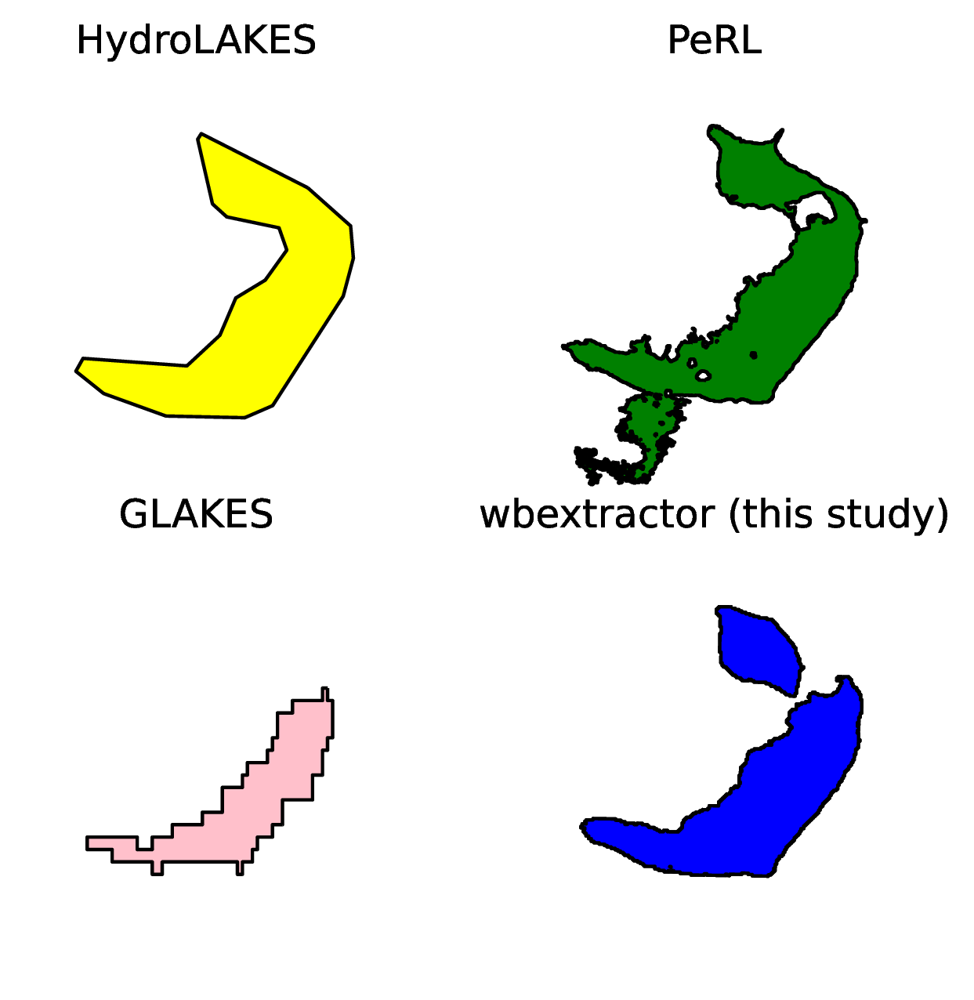
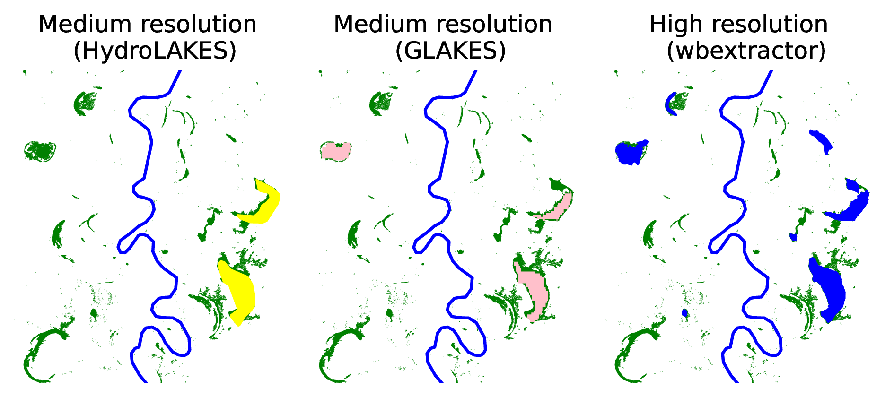
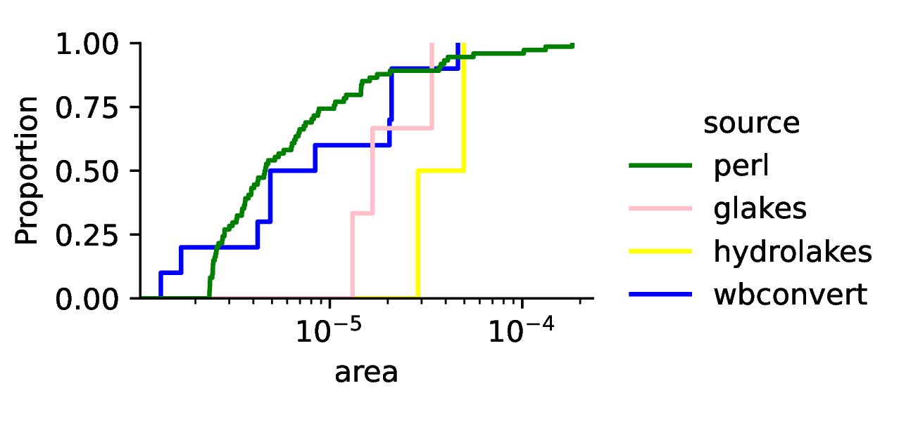

## Enabling high resolution hydrologic routing with machine learning assisted waterbody classification

  

Code for the publication:

> **Stachelek, J.**, Abolt, C.J., Schwenk, J., Enabling high resolution hydrologic routing with machine learning assisted waterbody classification.

### single waterbody in various product resolutions

### recovery of floodplain lakes

### area distribution matching

## References

> Stachelek, J., Abolt, C.J., Schwenk J. Scalable machine learning pipelines for waterbody delineation, classification, and change detection. Poster Presentation at the HydroML Symposium, Berkeley, CA, USA. May 23, 2023.

---

LA-UR-23-24918
