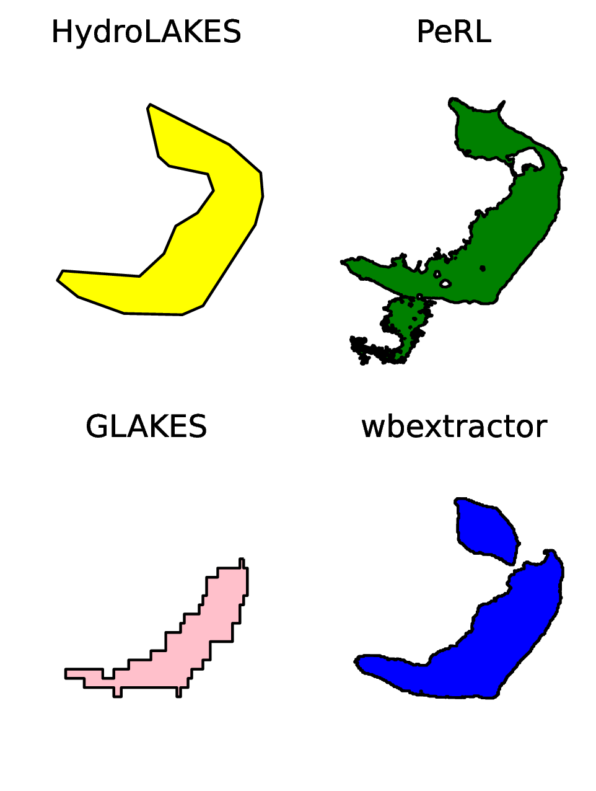

## Enabling high resolution hydrologic routing with machine learning assisted waterbody classification

[](https://doi.org/10.22541/essoar.171578782.22110644/v1) [](https://doi.org) [](https://doi.org)

Code for the publication:

> Stachelek J., Abolt, C.J., Schwenk, J. 2024. Enabling high resolution hydrologic routing with machine learning assisted waterbody classification. ESS Open Archive. https://doi.org/10.22541/essoar.171578782.22110644/v1

### Setup

```shell
# Follow wbextractor setup instructions, then:
export wbmask=/path/to/wbextractor/cli/wbmask
cp -R ~/path/to/wbextractor/checkpoints ./checkpoints
```

### single waterbody in various product resolutions



### recovery of floodplain lakes


### area distribution matching


## References

Stachelek, J., Abolt, C.J., Schwenk J. Scalable machine learning pipelines for waterbody delineation, classification, and change detection. Poster Presentation at the HydroML Symposium, Berkeley, CA, USA. May 23, 2023.

Stachelek J., Abolt, C.J., Schwenk, J. 2024. Enabling high resolution hydrologic routing with machine learning assisted waterbody classification. ESS Open Archive. https://doi.org/10.22541/essoar.171578782.22110644/v1

### Release

This software has been approved for open source release and has been assigned identifier **O4758**.

### Copyright

© 2024. Triad National Security, LLC. All rights reserved.
This program was produced under U.S. Government contract 89233218CNA000001 for Los Alamos National Laboratory (LANL), which is operated by Triad National Security, LLC for the U.S. Department of Energy/National Nuclear Security Administration. All rights in the program are reserved by Triad National Security, LLC, and the U.S. Department of Energy/National Nuclear Security Administration. The Government is granted for itself and others acting on its behalf a nonexclusive, paid-up, irrevocable worldwide license in this material to reproduce, prepare. derivative works, distribute copies to the public, perform publicly and display publicly, and to permit others to do so.
